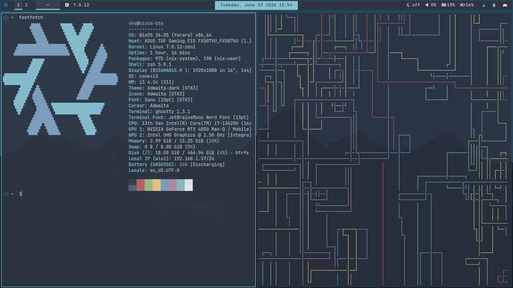

# dotfiles (. 📁)

- My i3wm dotfiles (Nord Theme)

## Packages & Dependencies :

 - Packages like xinput are pre-installed in NixOS, also all of this packages and dependencies are available in nixpkgs.

```picom, starship, xautolock, xinput (to list your input devices that would be used for i3 config file) , rofi, polybar, zathura, nvim, >= 0.11, ghostty, tmux, cava, btop, xfce4-power-manager (i used it to manage power button behaviors (recommended)), superfile, JetBrainsMono and FiraCode Nerd Fonts```
 
 - Link for starship: https://starship.rs/
 - Links for Nerd Fonts:
     - https://github.com/ryanoasis/nerd-fonts/releases/download/v3.4.0/JetBrainsMono.zip
     - https://github.com/ryanoasis/nerd-fonts/releases/download/v3.4.0/FiraCode.zip
 - Link for NvChad: https://nvchad.com/docs/quickstart/install
 - Link for Tmux Nord Theme: https://www.nordtheme.com/docs/ports/tmux/installation
 - Link for Superfile : https://superfile.dev/

# Preview :




## Directory Structure :

```
config
├── btop
│   └── themes
├── cava
│   ├── shaders
│   └── themes
├── dunst
├── ghostty
├── git
├── home-manager
├── i3
│   └── scripts
├── picom
├── polybar
│   └── scripts
├── rofi
│   ├── applets
│   │   ├── bin
│   │   ├── shared
│   │   ├── type-1
│   │   ├── type-2
│   │   ├── type-3
│   │   ├── type-4
│   │   └── type-5
│   ├── colors
│   ├── images
│   │   └── nord
│   ├── launchers
│   │   ├── type-1
│   │   │   └── shared
│   │   ├── type-2
│   │   │   └── shared
│   │   ├── type-3
│   │   │   └── shared
│   │   ├── type-4
│   │   │   └── shared
│   │   ├── type-5
│   │   ├── type-6
│   │   └── type-7
│   └── scripts
├── superfile
│   └── theme
├── tmux
└── zathura

```

## Setup :

  ```bash
        git clone https://github.com/0x01sky/dotfiles && cd dotfiles
        cp -r .config/{i3,rofi,polybar,ghostty,zathura,picom,cava,fish,tmux,btop,dunst,superfile,git} "$HOME/.config/"
        git clone https://github.com/tmux-plugins/tpm ~/.config/tmux/plugins/tpm  # to install tmux plugins which is necessary to install the themes
  ```
  - if you're using NixOS :
    
    * add ```home-manager``` to your system packages or user packages in nix configuration:
  
    * for others, make sure to follow https://home-manager.dev/manual/ !
        
**Enjoy!**
